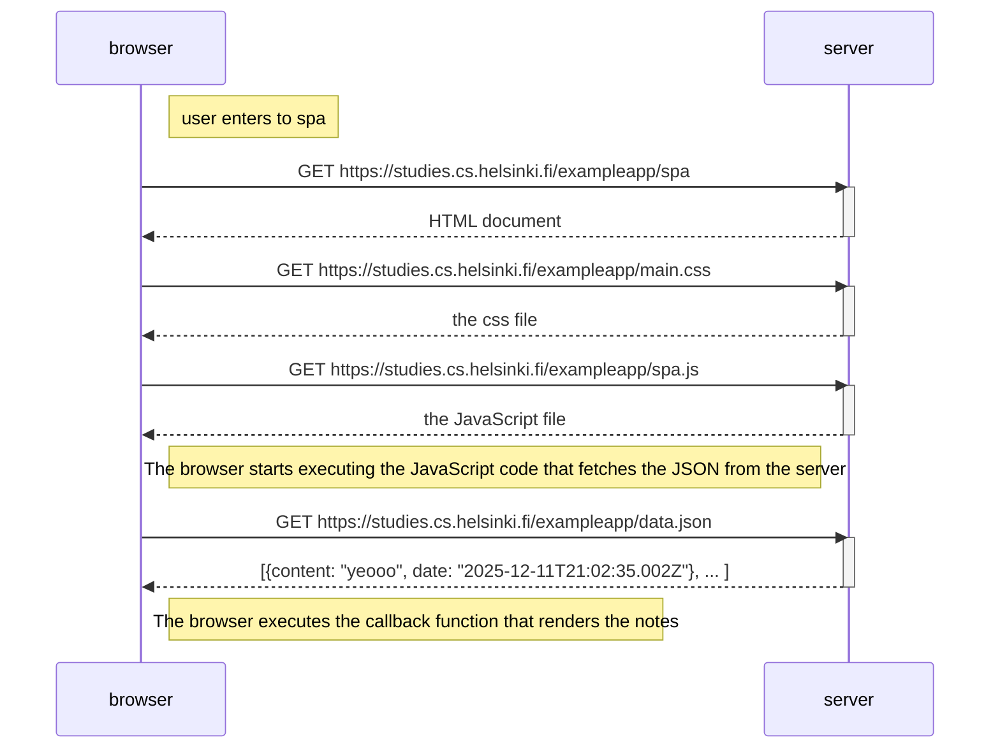

This is the solution to exercise 0.5.

```mermaid
sequenceDiagram
    participant browser
    participant server

    Note right of browser: user enters to spa

    browser->>server: GET https://studies.cs.helsinki.fi/exampleapp/spa
    activate server
    server-->>browser: HTML document
    deactivate server

    browser->>server: GET https://studies.cs.helsinki.fi/exampleapp/main.css
    activate server
    server-->>browser: the css file
    deactivate server

    browser->>server: GET https://studies.cs.helsinki.fi/exampleapp/spa.js
    activate server
    server-->>browser: the JavaScript file
    deactivate server

    Note right of browser: The browser starts executing the JavaScript code that fetches the JSON from the server

    browser->>server: GET https://studies.cs.helsinki.fi/exampleapp/data.json
    activate server
    server-->>browser: [{content: "yeooo", date: "2025-12-11T21:02:35.002Z"}, ... ]
    deactivate server

    Note right of browser: The browser executes the callback function that renders the notes
```
