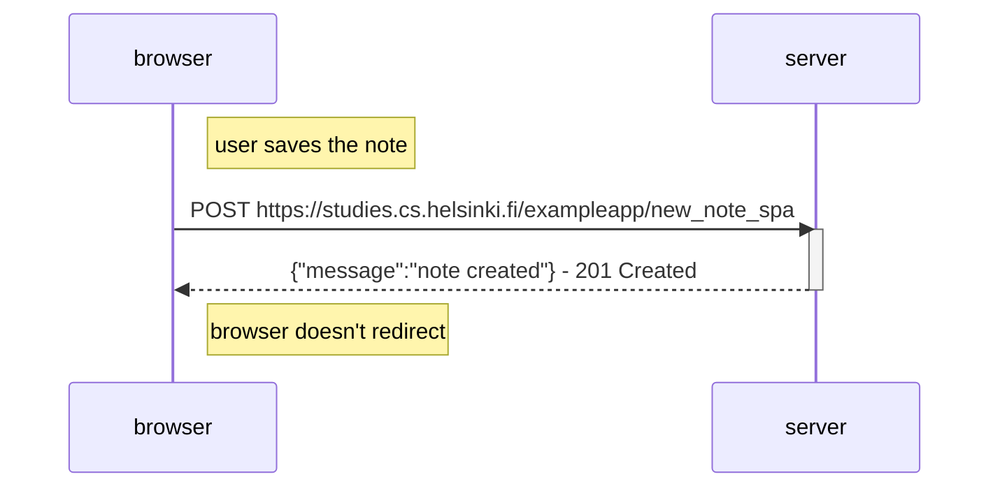

This is the solution to exercise 0.6.

```mermaid
sequenceDiagram
    participant browser
    participant server

    Note right of browser: user saves the note

    browser->>server: POST https://studies.cs.helsinki.fi/exampleapp/new_note_spa
    activate server
    server-->>browser: {"message":"note created"} - 201 Created
    deactivate server

    Note right of browser: browser doesn't redirect
```
